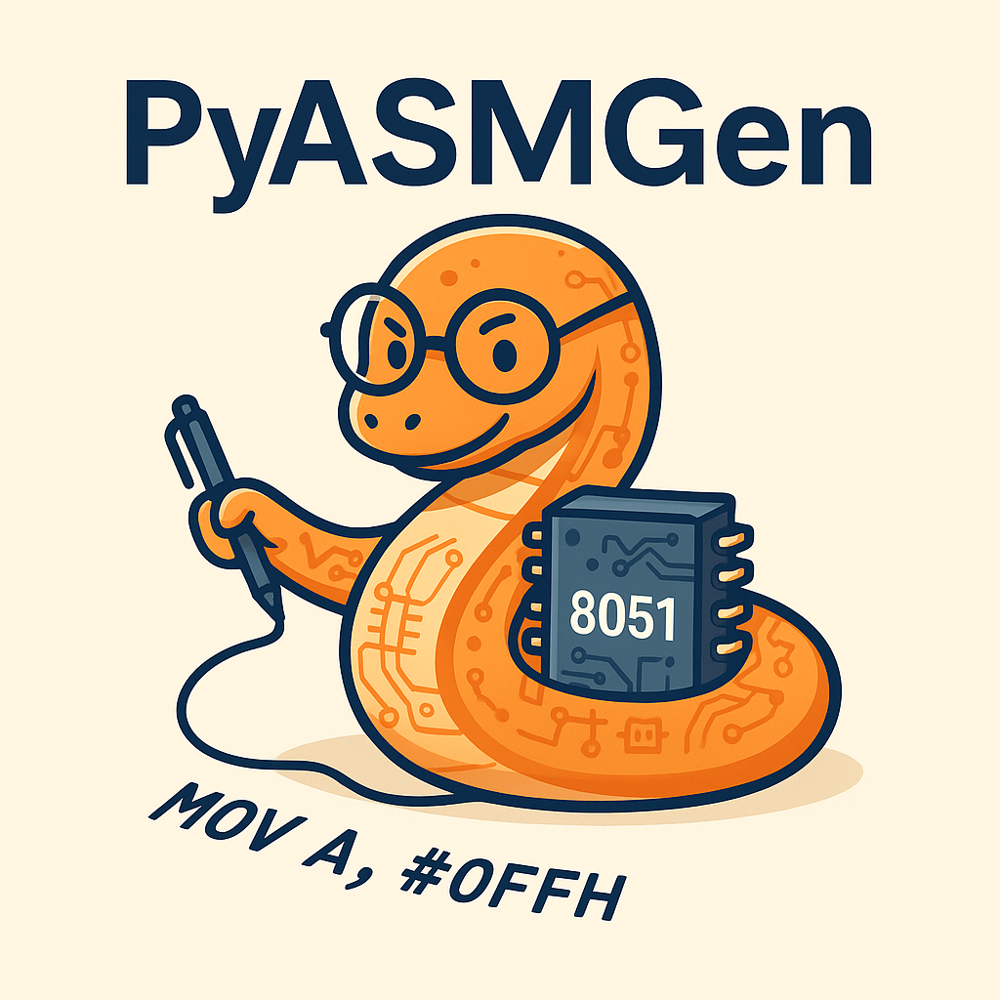

<p align="center">

</p>

---

# PyASMGen

> Write 8051 Assembly with Python.  
> Writing SDK is better than writing Assembly 😎

---

## What is this?

**PyASMGen** is a Python-based 8051 Assembly code generator. It's made for electronics and embedded systems students who:

- Are tired of typing `MOV A, #0FFH` over and over
- Keep messing up `SJMP` target addresses
- Can write the logic but hate syntax fuss

You write Python, it outputs real assembly.  
Your code works. Your homework is done. Your teacher won’t complain. 👨‍🏫

---

## Why did I make this?

Because:

- Python is just nicer than assembly
- Assembly syntax errors are unforgiving
- It’s easier to debug, submit and share logic using Python
- Honestly, it’s just fun 🤪

---

## Features

- ✅ Instruction set wrapped in Python methods
- 🧠 Built-in parameter checking and error alerts
- 🧱 Declarative programming style (coming soon)
- 🔌 Can be integrated with LLMs (e.g., [Llyra](https://github.com/albus-shore/Llyra))
- 🐍 Pure Python, cross-platform

---

## Roadmap

- [ ] Support for interrupts & serial communication
- [ ] Macros and conditional generation
- [ ] Auto-commenting of assembly
- [ ] Syntax correction + semantic hints
- [ ] HEX file generation & Keil/Proteus integration

---

## Install

```bash
pip install pyasmgen
```

(Not on PyPI yet — clone the repo for now)

---

## Slogan

> **"Writing SDK is better than writing Assembly 😎"**

---

## License

MIT License — for students, by a student 🧑‍🤝‍🧑

---
